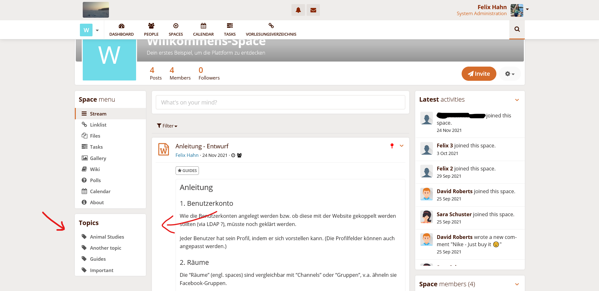
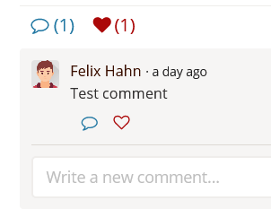
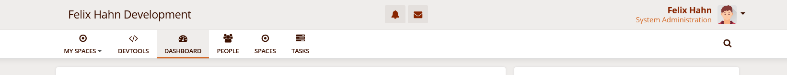
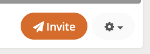
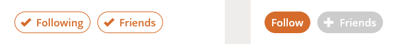

# [HumHub](https://humhub.org) OrangeTheme

### A child theme for HumHub

**Version: 0.4.1**

Corresponding versions (espacially for the CSS file):

[v0.4.1](https://github.com/felixhahnweilheim/humhub-themes-orange/releases/tag/v0.4.1) / [v0.4](https://github.com/felixhahnweilheim/humhub-themes-orange/releases/tag/v0.4.0) => HumHub 1.13

[v0.3](https://github.com/felixhahnweilheim/humhub-themes-orange/releases/tag/v0.3.0) => HumHub 1.12

[v0.2](https://github.com/felixhahnweilheim/humhub-themes-orange/releases/tag/v0.2.0) => HumHub 1.11

[v0.1](https://github.com/felixhahnweilheim/humhub-themes-orange/releases/tag/v0.1.0) => HumHub 1.10

This is a child [theme module](https://docs.humhub.org/docs/theme/module#theme-module), the changes compared to the community theme are listed below.

**Author:** Felix Hahn, info@hahn-felix.de - self-learned

## State of development
The theme works fine in my HumHub installations, but I have not tested all possible settings and available modules.
That's why I recommend you to test the module with your settings, modules etc. and/or look through my code before activating it on a production site.

Please give me some feedback how it works for you.

## Changes in comparison to the community theme
### 1. Topic list in spaces and profiles
**Thanks to @raphaeljolivet** (see https://github.com/humhub/humhub/pull/4785) I was able to add a topic list to the left sidebar of spaces (only shown if there is at least one topic)

### 2. Comment and like icons instead of text

### 3. Colors
- bright topbar (added variable @custom-topbar-background and @custom-topbar-contrast)

- bright dropdown menus (background same as topbar), text-color: @text-color-highlight instead of white
- color changes in comparison to the HumHub Community theme are mentioned in the file `less/variables.less`

#### Added hover effects
- see `less/mixins.less` (added color variable @hover)
- Hover for "view all" in the tasks widget header, see `less/tasks.less`

### 4. Restyled buttons
see `less/button.less`

### 6. Added Language Switcher in
- Login modal window, at the bottom
- Registration page, beneath the title
- dashboard for guests

### 7. Editor for tasks, wiki, polls etc.: fixed non-floating menubar lead to a lot of scrolling on mobile
see `less/mixins.less` (solved with max-height)

### 8. Modified Dashboard for guests
does not show the widget "New Spaces" in order not to show internal things to the public
shows the language switcher

### 9. [Some smaller things ...](DETAILS.md)
